# Arogya-Sahaya Local  
### Digital Healthcare Companion for Rural Communities & Elderly Patients

Arogya-Sahaya Local is a localized healthcare assistance Android application designed for elderly patients and rural communities. The app helps users manage medicine schedules, receive accurate reminders, track vital health indicators like BP and glucose, maintain medical profiles, connect with local ASHA health camps, and access emergency SOS support through a simple and accessible interface.

This project focuses on creating a **Zero-Error Health Monitoring System** for medicine adherence, local health checkups, and emergency medical support.

---

# Problem Statement

In most rural areas, healthcare follow-ups are often missed because elderly patients struggle to manage multiple medications and remember the dates of visiting health camps or ASHA worker rounds.

This leads to poor health outcomes and preventable complications.

There is a need for a **Digital Health Companion** that simplifies medicine schedules, health monitoring, and emergency access for users who may not be tech-savvy.

---

# Vision

Arogya-Sahaya Local aims to provide:

- Zero-error medicine scheduling
- Smart medication reminders
- Vital health tracking
- ASHA worker health camp support
- Emergency SOS medical assistance
- Better healthcare inclusion for rural families

---

# Key Features

## 1. Medical Profile

Users can store:

- Full Name
- Age
- Blood Group
- Chronic Conditions
- Emergency Contact
- Address

This helps during emergencies and doctor consultations.

---

## 2. Medicine Reminder

Users can:

- Add medicine names
- Set dosage
- Select Morning / Afternoon / Night schedule
- Set exact reminder time

Uses AlarmManager + Notifications for accurate alerts.

---

## 3. Medicine History

Displays all saved medicines with:

- Reminder schedules
- Reminder times
- Edit/Delete options

---

## 4. Vital Health Log

Users can track:

- Blood Pressure
- Heart Rate
- Glucose Level
- Weight
- Daily Health Notes

Stored locally using Room Database.

---

## 5. Health Analytics (7-Day Trend Graph)

Visual representation using MPAndroidChart for:

- Blood Pressure Graph
- Heart Rate Graph
- Glucose Graph

Helps in preventive healthcare monitoring.

---

## 6. ASHA Connect

Shows:

- Local health camps
- Vaccination drives
- Village health schedules
- Assigned ASHA worker details

Improves rural healthcare access.

---

## 7. Emergency SOS

Provides:

- Ambulance quick call (108)
- Family alert support
- Nearby hospital access
- Share location help

Designed for instant emergency response.

---

# Tech Stack

## Frontend

- Kotlin
- Jetpack Compose
- Material 3 UI

## Backend Logic

- MVVM Architecture
- Repository Pattern
- StateFlow

## Local Storage

- Room Database

## Notifications

- AlarmManager
- BroadcastReceiver
- WorkManager

## Graphs

- MPAndroidChart

## Development Tool

- Android Studio

---

# Project Architecture

This project follows:

## MVVM + Repository Pattern

```text
UI Layer
↓
ViewModel Layer
↓
Repository Layer
↓
Room Database (DAO + Entity)
```

This improves:

- Clean code structure
- Scalability
- Maintainability
- Testability

---

# Project Folder Structure

```text
ArogyaSahayaLocal/
│
├── app/
│   ├── src/
│   │   ├── main/
│   │   │   ├── java/com/sadiq/arogyasahayalocal/
│   │   │   │
│   │   │   │── data/
│   │   │   │   ├── local/
│   │   │   │   │   ├── AppDatabase
│   │   │   │   │   ├── MedicineDao
│   │   │   │   │   ├── ProfileDao
│   │   │   │   │   ├── UserDao
│   │   │   │   │   ├── VitalLogDao
│   │   │   │   │   └── HealthCampDao
│   │   │   │   │
│   │   │   │   ├── repository/
│   │   │   │   │   ├── MedicineRepository
│   │   │   │   │   ├── ProfileRepository
│   │   │   │   │   ├── UserRepository
│   │   │   │   │   ├── VitalLogRepository
│   │   │   │   │   └── HealthCampRepository
│   │   │   │   │
│   │   │   │   ├── MedicineEntity
│   │   │   │   ├── ProfileEntity
│   │   │   │   ├── UserEntity
│   │   │   │   ├── VitalLogEntity
│   │   │   │   └── HealthCampEntity
│   │   │   │
│   │   │   │── notification/
│   │   │   │   ├── AlarmReceiver
│   │   │   │   ├── AlarmScheduler
│   │   │   │   └── NotificationHelper
│   │   │   │
│   │   │   │── worker/
│   │   │   │   └── ReminderWorker
│   │   │   │
│   │   │   │── ui/
│   │   │   │   ├── screens/
│   │   │   │   │   ├── LoginScreen
│   │   │   │   │   ├── RegisterScreen
│   │   │   │   │   ├── DashboardScreen
│   │   │   │   │   ├── MedicalProfileScreen
│   │   │   │   │   ├── AddMedicineScreen
│   │   │   │   │   ├── MedicineHistoryScreen
│   │   │   │   │   ├── VitalLogScreen
│   │   │   │   │   ├── VitalGraphScreen
│   │   │   │   │   ├── AshaConnectScreen
│   │   │   │   │   └── EmergencySOSScreen
│   │   │   │
│   │   │   │── viewmodel/
│   │   │   │── MainActivity
│   │   │
│   │   │── res/
│   │   │── AndroidManifest.xml
│
├── build.gradle
├── settings.gradle
└── README.md
```

---

# App Screenshots

## Login Screen

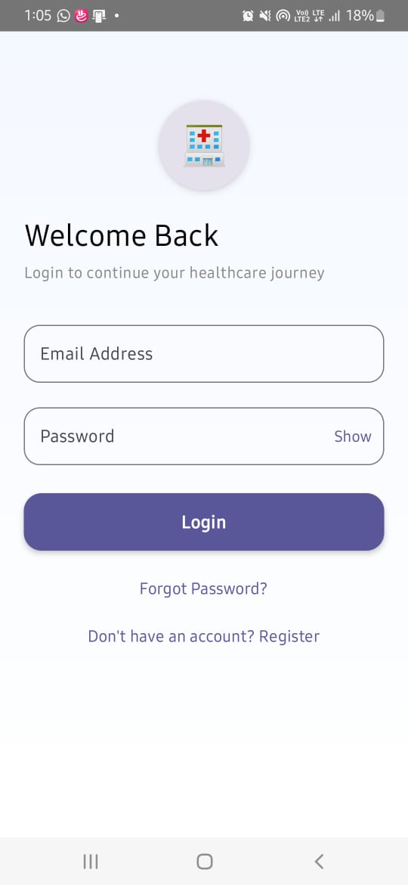

---

## Register Screen

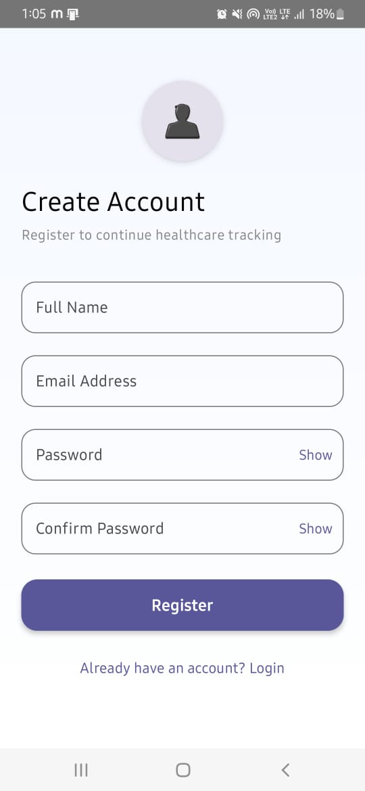

---

## Dashboard Screen 1

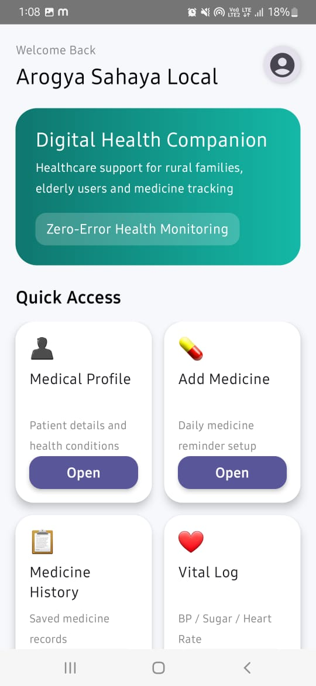

---

## Dashboard Screen 2

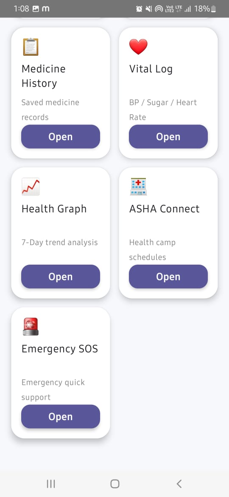

---

## Add Medicine Screen

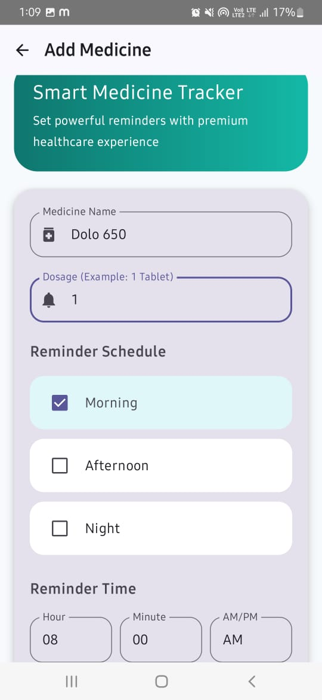

---

## Medicine History Screen

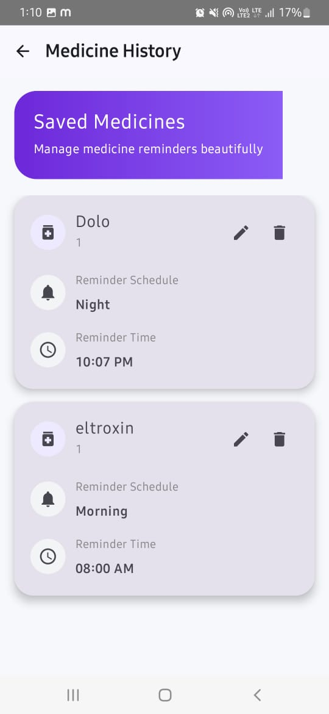

---

## Medical Profile Screen

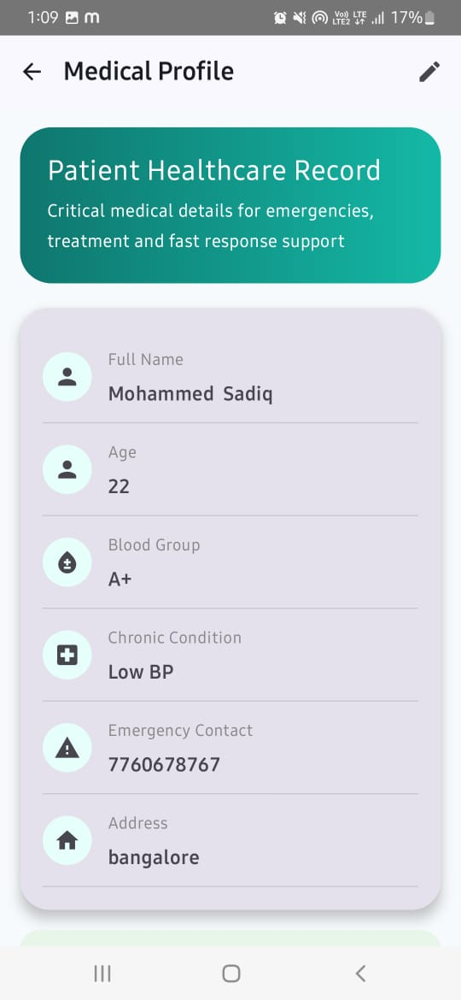

---

## Vital Log Screen

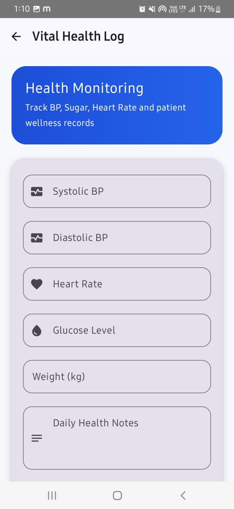

---

## Health Analytics Graph 1

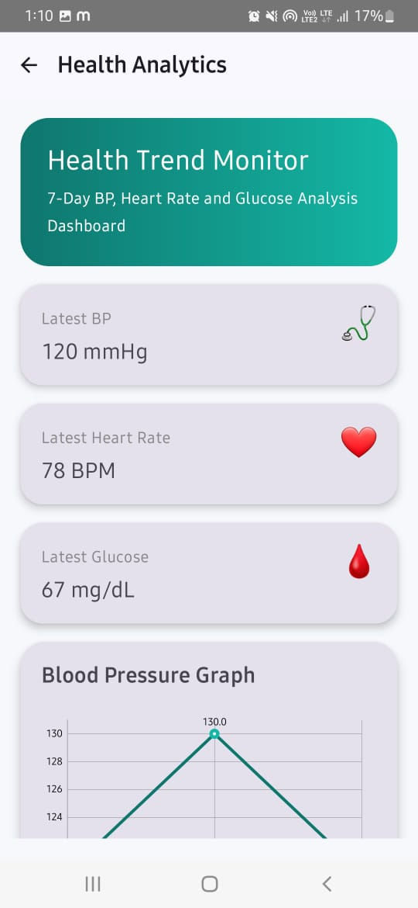

---

## Health Analytics Graph 2

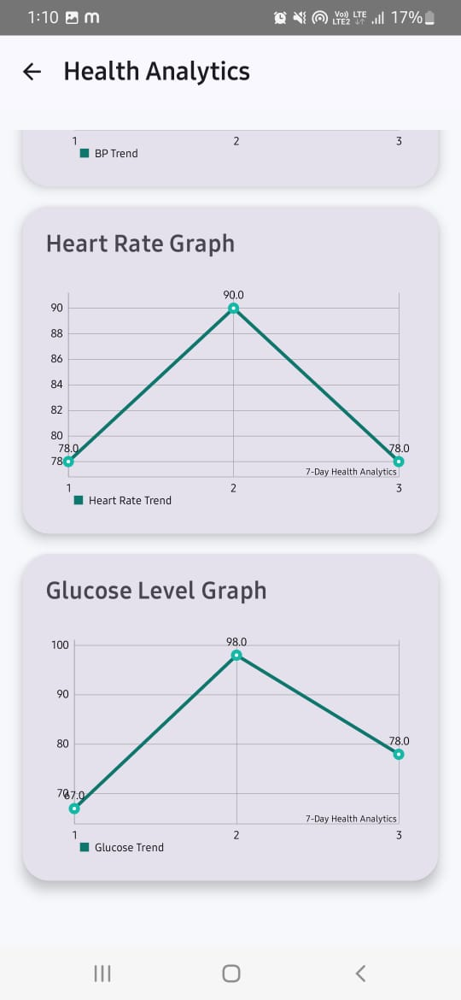

---

## ASHA Connect Screen

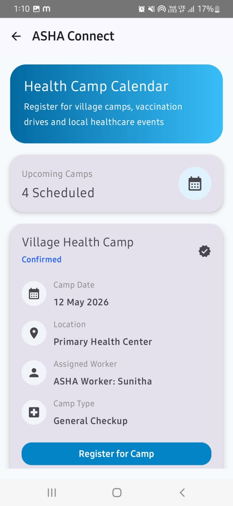

---

## Emergency SOS Screen 1

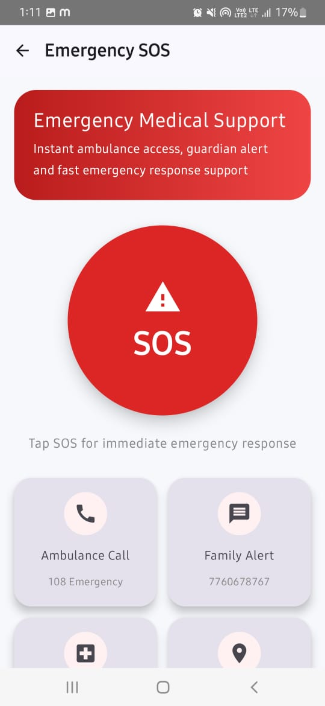

---

## Emergency SOS Screen 2

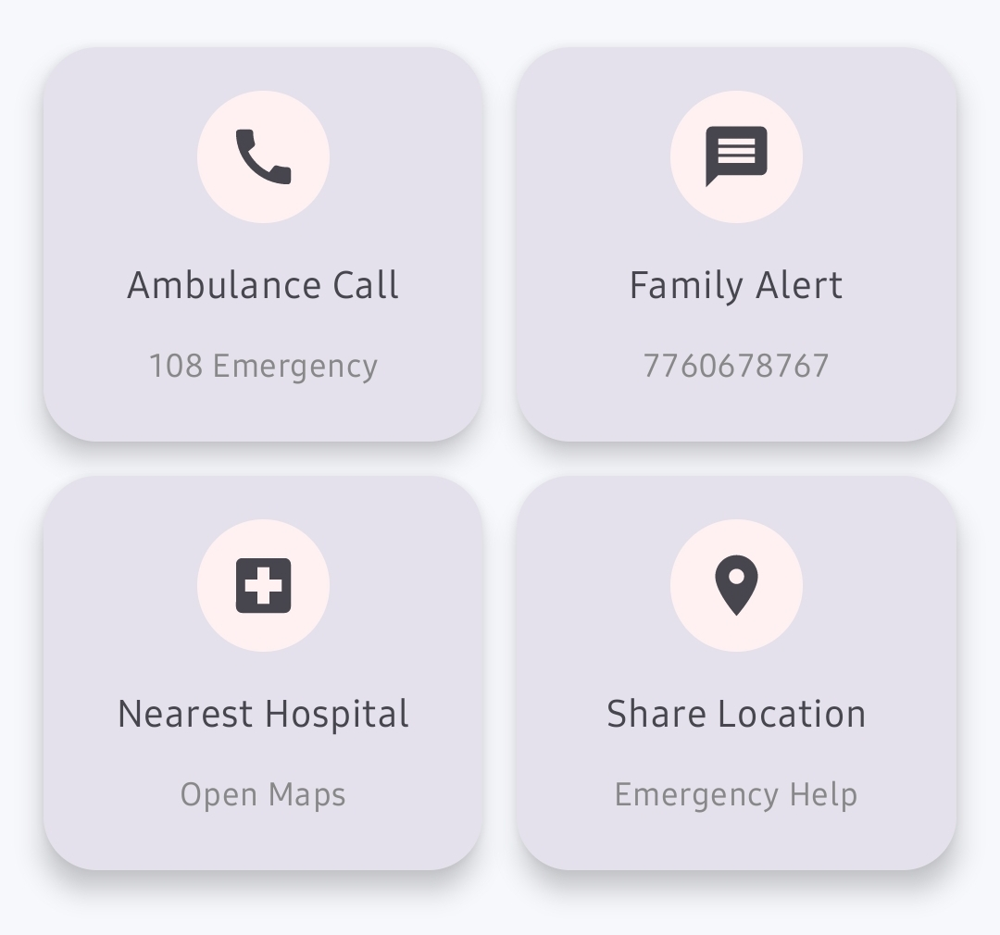

# APK Download

Download APK here:

Paste your Google Drive APK link here

Example:

https://drive.google.com/your-apk-link

---

# GitHub Repository

Project Source Code:

https://github.com/mdSadiqra/ArogyaSahayaLocal

---

# Future Scope

Future improvements:

- Real-time doctor consultation
- Cloud sync with Firebase
- AI-powered health suggestions
- Voice assistant for elderly users
- Multi-language support
- Hospital appointment booking

---

# Impact Goals

## Health Inclusion

Helping elderly users in remote villages maintain medicine adherence like urban users.

## Data-Driven Care

Helping ASHA workers with organized patient health history.

## Preventive Healthcare

Reducing emergency hospitalizations through continuous monitoring.

---

# Success Criteria Achieved

- Accurate medicine reminders using AlarmManager
- 7-day health trend graph generation
- Elder-friendly UI with high contrast design
- Repository Pattern implementation
- Local offline healthcare support

---

# Author

## Mohammed Sadiq

Android Developer | GenAI Builder | Healthcare App Developer

Project developed for:

**Android App Development using GenAI — Internship Project Phase**

---

# License

This project is developed for academic, internship, and learning purposes.
